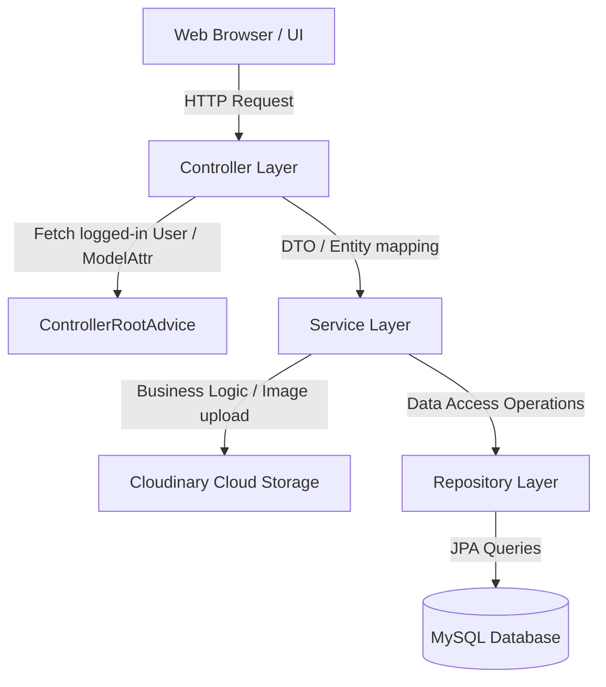

# Smart Contact Manager (SCM)

A full-stack, enterprise-grade Spring Boot application designed to help users securely store, organize, and manage their contact books. It features robust user authentication (local database-backed and Google OAuth2), paginated contact list lookup, real-time searching, dynamic client-side modals, and cloud-hosted contact images using Cloudinary.

---

## 🚀 Key Features

* **Dual Authentication Mechanisms**: Secure login utilizing either standard email/password (backed by BCrypt hashing) or Google OAuth2 social login.
* **Email Verification & Account Activation**: Automatically dispatches email verification links to verify users and activate accounts after registration.
* **Granular Contact Management**: Create, view, search, and manage user-specific contact lists.
* **Advanced Pagination & Sorting**: High-performance paginated listings for contacts to support large data sets efficiently.
* **Multi-Criteria Search**: Dynamic search capabilities allowing filtering of contacts by name, email, or phone number with pagination support.
* **Cloud-based Asset Hosting**: Profile picture uploads integrated directly with Cloudinary, featuring automatic resizing and cropping transformations.
* **Modern Responsive Interface**: Built with Thymeleaf templates, TailwindCSS, Flowbite components, and FontAwesome icons, complete with light/dark theme aesthetics and dynamic modal overlays.

---

## 🛠️ Technology Stack

| Component | Technology |
| :--- | :--- |
| **Backend Framework** | Spring Boot 3.5.7, Spring MVC |
| **Security Framework** | Spring Security, OAuth2 Client |
| **Database & Persistence** | MySQL, Spring Data JPA, Hibernate |
| **Asset Storage** | Cloudinary API |
| **Mail Services** | Spring Boot Starter Mail, SMTP |
| **Template Engine** | Thymeleaf |
| **Frontend Styles** | TailwindCSS, Flowbite UI, CSS3 |
| **Frontend Logic** | Vanilla Javascript |
| **Dependency Management** | Maven, Java 21 |

---

## 🏛️ Application Architecture & Structure

The codebase adheres strictly to the **MVC (Model-View-Controller) Architectural Pattern**, cleanly separating database entity mapping, repository queries, business logic services, and controller routing.



### 📂 Directory Structure

Below is the layout of the source repository, highlighting the primary packages and resource structures:

```text
d:/SpringProject/project/
├── .mvn/                             # Maven wrapper properties
├── mvnw / mvnw.cmd                   # Maven wrapper executables
├── pom.xml                           # Project dependencies and plugins config
├── tailwind.config.js                # Tailwind CSS compilation properties
├── package.json                      # NPM configuration for build tools
└── src/
    ├── main/
    │   ├── java/com/scm/project/     # Root application package
    │   │   ├── ProjectApplication.java # Spring Boot main startup entry point
    │   │   ├── config/               # Security and Cloud Beans configuration
    │   │   │   ├── AppConfig.java
    │   │   │   └── SecurityConfig.java
    │   │   ├── controller/           # Web controllers and global advice mapping
    │   │   │   ├── ApiController.java
    │   │   │   ├── ControllerRoot.java
    │   │   │   ├── EmailAuthController.java # Email verification token processing
    │   │   │   ├── ProjectController.java
    │   │   │   ├── UserController.java
    │   │   │   └── contactController.java
    │   │   ├── Entity/               # JPA Entities / Models
    │   │   │   ├── Contact.java
    │   │   │   ├── Provider.java
    │   │   │   ├── SocialLink.java
    │   │   │   └── User.java
    │   │   ├── FormData/             # Form backing DTOs with validation rules
    │   │   │   ├── ContactForm.java
    │   │   │   └── UserForm.java
    │   │   ├── helper/               # Helper utilities, constants, and custom exceptions
    │   │   │   ├── AppConstants.java
    │   │   │   ├── Helper.java
    │   │   │   ├── Message.java
    │   │   │   ├── MessageType.java
    │   │   │   ├── ResourceNotFound.java
    │   │   │   ├── SessionHelper.java
    │   │   │   └── UserEnabledException.java # Custom login failure handler for disabled users
    │   │   └── services/             # Service contracts and concrete implementations
    │   │       ├── contactService.java
    │   │       ├── imageService.java
    │   │       ├── MailService.java      # Interface for sending automated verification emails
    │   │       ├── userService.java
    │   │       └── serviceImplement/
    │   │           ├── SecurityCustomUserDetailService.java
    │   │           ├── contactImpl.java
    │   │           ├── imageImpl.java
    │   │           ├── MailServiceImpl.java  # JavaMailSender implementation of MailService
    │   │           └── userImpl.java
    │   └── resources/
    │       ├── application.properties # Main application properties configuration
    │       ├── static/               # Client-side static assets
    │       │   ├── css/              # Tailwind compiled outputs and custom stylesheets
    │       │   │   ├── input.css
    │       │   │   ├── output.css
    │       │   │   └── style.css
    │       │   └── JS/               # Frontend client logic scripts
    │       │       └── contact.js
    │       └── templates/            # Thymeleaf HTML5 page templates
    │           ├── Base.html         # Main decorator layout wrapper
    │           ├── about.html
    │           ├── contact.html
    │           ├── home.html
    │           ├── login.html
    │           ├── message.html
    │           ├── navbar.html
    │           ├── services.html
    │           ├── signup.html
    │           └── user/             # Secure authenticated user views
    │               ├── add_contact.html
    │               ├── contact_modal.html
    │               ├── contacts.html
    │               ├── dashboard.html
    │               ├── profile.html
    │               ├── search.html
    │               ├── sidebar.html
    │               └── user_navbar.html
    └── test/                         # Unit and integration test components
```

---

## 📦 Architecture Details & Modules

### 1. Security & Authentication Layer
* **Spring Security Config**: [SecurityConfig.java](file:///d:/SpringProject/project/src/main/java/com/scm/project/config/SecurityConfig.java) defines custom route authorization. Paths matching `/user/**` are private and require authorization. All other routes are public. Uses `server.forward-headers-strategy=FRAMEWORK` to respect proxy headers (`X-Forwarded-*`) from reverse proxies (e.g. Render, Railway) for correct OAuth2 redirect URIs.
* **Form Authentication**: Utilizes standard database lookups. Email is set as the username parameter, and passwords are authenticated via [SecurityCustomUserDetailService.java](file:///d:/SpringProject/project/src/main/java/com/scm/project/services/serviceImplement/SecurityCustomUserDetailService.java) utilizing BCrypt matching.
* **Social OAuth2 Logins**: Google integration is configured. Upon successful authentication, a custom success handler reads attributes (email, name, picture), registers the user locally under `Provider.GOOGLE` if they are new, and redirects them to the private dashboard.
* **Account Verification Flow**: New accounts are created as disabled. A custom failure handler [UserEnabledException.java](file:///d:/SpringProject/project/src/main/java/com/scm/project/helper/UserEnabledException.java) redirects disabled users attempting to log in with an explanatory message. When the user visits the link in their mail, [EmailAuthController.java](file:///d:/SpringProject/project/src/main/java/com/scm/project/controller/EmailAuthController.java) verifies the UUID email token and enables the user.

### 2. JPA Database & Entity Model
* **User**: [User.java](file:///d:/SpringProject/project/src/main/java/com/scm/project/Entity/User.java) implements `UserDetails`, storing system roles (`ROLE_USER`) and user credentials. It tracks account state (`enable`, `emailVarified`) and contains `emailToken` mapping properties.
* **Contact**: [Contact.java](file:///d:/SpringProject/project/src/main/java/com/scm/project/Entity/Contact.java) defines properties for individual contacts, including name, email, address, phone number, picture URL, and favorite status. Holds a unique `contactPublicId` representing the Cloudinary asset identifier.
* **Repository Queries**: [ContactRepo.java](file:///d:/SpringProject/project/src/main/java/com/scm/project/repository/ContactRepo.java) leverages Spring Data JPA finder methods for pagination. It utilizes standard keyword matches and a custom JPQL query for comprehensive searches.

### 3. Business Service Layer
* **User Management**: [userImpl.java](file:///d:/SpringProject/project/src/main/java/com/scm/project/services/serviceImplement/userImpl.java) creates and saves accounts, encrypting raw passwords via standard Spring autowired decoders. It also generates a verification token, triggers mail sending, and saves users as disabled by default.
* **Mail Service**: [MailServiceImpl.java](file:///d:/SpringProject/project/src/main/java/com/scm/project/services/serviceImplement/MailServiceImpl.java) uses `SimpleMailMessage` and standard Java Mail dependencies to send registration verification links. It explicitly sets the `From` address using the injected `spring.mail.username` property for compatibility with strict SMTP servers (like Gmail).
* **Contact Operations**: [contactImpl.java](src/main/java/com/scm/project/services/serviceImplement/contactImpl.java) executes CRUD actions, formatting search outputs, mapping parameters, and handling paginated queries.
* **Cloudinary Image Hosting**: [imageImpl.java](src/main/java/com/scm/project/services/serviceImplement/imageImpl.java) reads Multipart files, pushes binary arrays to Cloudinary API repositories, and requests server-side cropping (`fill` style) to enforce consistent user profiles.

### 4. Controller & Global Advice Layer
* **Project Controller**: Handles public page traffic and triggers form backing data bindings for registration validation.
* **Contact Controller**: Secure endpoints (`/user/contacts/*`) that handle adding new entries (processing file uploads), retrieving paginated tables, and routing search operations.
* **ApiController**: Rest interface to query database records dynamically without forcing page updates.
* **Global Advice Controller**: [ControllerRoot.java](src/main/java/com/scm/project/controller/ControllerRoot.java) listens globally via `@ControllerAdvice`, intercepting controller models to query context authentication tokens and inject logged-in User profiles directly into active sessions.

### 5. Frontend & UI Engine
* **Decorating Layouts**: [Base.html](src/main/resources/templates/Base.html) manages standard framework inclusions, switching navbar representations depending on session values.
* **Dynamic Modals**: Dynamic contact lookups rely on client-side JS. [contact.js](src/main/resources/static/JS/contact.js) parses data-attributes from table rows to display structured summaries inside overlay modals on demand.

---

## ⚙️ How to Configure & Run

### 📋 Prerequisites
1. **Java SDK 21** installed and configured in your environment variable paths.
2. **MySQL Database Server** running locally or remotely.
3. A **Cloudinary Account** to retrieve storage integration API tokens.
4. (Optional) **Google Cloud Platform credentials** for OAuth2 social registration.

### 🛠️ Configuration Settings
Open [application.properties](src/main/resources/application.properties) and update the following settings to match your local profile:

```properties
# Server settings
server.port=8081

# MySQL Database setup
spring.datasource.url=jdbc:mysql://localhost:3306/scm
spring.datasource.username=YOUR_MYSQL_USERNAME
spring.datasource.password=YOUR_MYSQL_PASSWORD

# Google OAuth2 credentials
spring.security.oauth2.client.registration.google.client-id=YOUR_GOOGLE_CLIENT_ID
spring.security.oauth2.client.registration.google.client-secret=YOUR_GOOGLE_CLIENT_SECRET

# Cloudinary Integration setup
cloudinary.cloud.name=YOUR_CLOUDINARY_CLOUD_NAME
cloudinary.api.key=YOUR_CLOUDINARY_API_KEY
cloudinary.api.secret=YOUR_CLOUDINARY_API_SECRET

# Spring Mail (SMTP) setup
spring.mail.host=smtp.gmail.com
spring.mail.port=587
spring.mail.username=YOUR_EMAIL_USERNAME
spring.mail.password=YOUR_EMAIL_APP_PASSWORD
spring.mail.properties.mail.smtp.auth=true
spring.mail.properties.mail.smtp.starttls.enable=true

# Reverse Proxy / SSL Termination Support (Required when deployed behind proxies e.g. Render, Railway)
server.forward-headers-strategy=FRAMEWORK
```

### 🖥️ Run the Application
You can run the project using the included Maven wrapper in your terminal:

* **Windows Command Prompt / PowerShell:**
  ```powershell
  ./mvnw.cmd spring-boot:run
  ```
* **macOS / Linux Terminal:**
  ```bash
  ./mvnw spring-boot:run
  ```

Once compiled and started successfully, open your web browser and navigate to:
```text
http://localhost:8081
```
